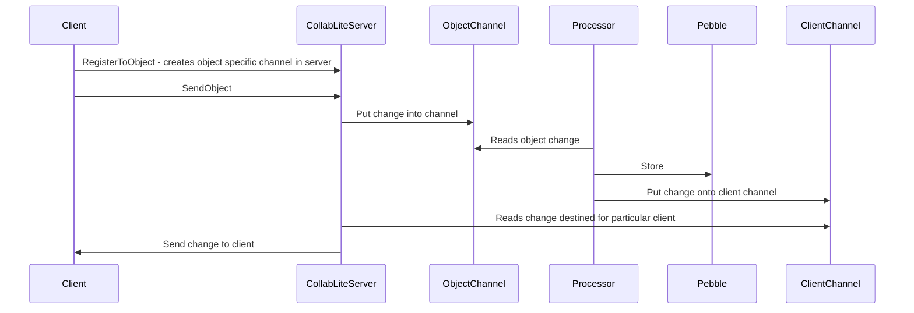

# Collablite

Conflict free (mostly) data sharing service. Inspired by the Figma [post](https://www.figma.com/blog/how-figmas-multiplayer-technology-works/)

aka, CRDT without the CRDT bit :)

## What is it?

Collablite is a service that allows multiple clients to share data with each other in a consistent and conflict free manner.
It is inspired by the Figma post on their multiplayer technology.
It is not a CRDT implementation, but it does use a similar approach to allow multiple clients to share data without conflict.

## How does it work?

There are a number of key features/conditions that this service provides:

- For a given object being edited (by multiple clients) the object exists ONLY in a single instance of the service. This may
  seem like a scaling issue in the future, but given that it's NOT expected that a LOT of changes will be happening to a single
  document at any one time, this should be safe. IF the instance of the service dies, then a new one can be fired up immediately
  and all clients can reconnect and continue. The state of the object at the time the service died is persisted so very little (if any)
  changes should be lost. Currently this is deemed acceptable.

  If the situation arises where a single instance of the service (for a specific object) is NOT sufficient and horizontal scaling would
  be required to meet the load, then a solution would be investigated then, but I don't want to go down that route yet.

- If more then one instance is required (to handle the general load, NOT specifically for one object) then the load balancer
  mechanism used will need to have some support for server affinity. If affinity cannot be handled then changes will NOT be
  shared correctly across clients.

- The resolution of concurrent conflicts of an object is that "last write wins". This is a simple approach but works well.
  Please see the Figma [post](https://www.figma.com/blog/how-figmas-multiplayer-technology-works/) for more details.


## Architecture

The server is a comparatively simple service that takes incoming changes for an object from a client, persists to storage and then
broadcasts the change to all other clients interested in the same object.
The client is responsible for sending changes to the server, accepting incoming changes from the server and knowing when
to apply them to the local object and when the changes should be ignored (due to conflict)

### Server

The key parts to the server are:
- Creates two types of channels. One specific for an object and one specific for a client
- Receive the change from the client and puts onto object specific channel
- Processor instance created for each object
- Processor reads object channel, persists to storage and sends change to client specific channel
- Server reads client specific channel and returns change to all clients subscribed to object

The core workflow of the server is:




### Client

The key parts to the client are:
- Sends differences to server (not entire objects)
- Maintains list of local changes that it sends to the server
- Receives changes from server
- Determines of change needs to be accepted or rejected (based on last-write-wins conflict rule)

The developer creating a client application has a number of responsibilities to ensure correct functionality:
- Create struct for own state. This is completely up to the app developer. 
- Create conversion function to migrate data between app structure and [ClientObject](https://github.com/kpfaulkner/collablite/blob/57baad710ef3c2cae37dcf24ef41dce5f0338205/client/models.go#L29) . These functions must match the [Converter](https://github.com/kpfaulkner/collablite/blob/57baad710ef3c2cae37dcf24ef41dce5f0338205/client/converters/converter.go#L9) interface. For example [here](https://github.com/kpfaulkner/collablite/blob/57baad710ef3c2cae37dcf24ef41dce5f0338205/client/converters/keyvalue/keyvalue.go#L39)
- The conversion functions are called from the client library whenever an incoming change is received from the server, this means that the conversion functions should not be blocking nor time consuming.


An example client is [provided](https://github.com/kpfaulkner/collablite/blob/main/cmd/client/simpleproperty/main.go). This is a basic client that internally just treats an object as a key/value pair.

An abbreviated version of this is:

```
package main

import (
	"context"
	"flag"
	"fmt"
	"math/rand"
	"sync"
	"time"

	"github.com/google/uuid"
	"github.com/kpfaulkner/collablite/client"
	"github.com/kpfaulkner/collablite/client/converters/keyvalue"
	"github.com/kpfaulkner/collablite/cmd/common"
)

// Simple key/value example...
func main() {
    host := "localhost:50051"
    objectID := "testobject"

    // new client to collablite server
    cli := client.NewClient(host)

    // create our keyvalue object that we're going to sync/manipulate
    kv := keyvalue.NewKeyValueObject(objectID)

    // register converters used to convert to/from KeyValueObject to the ClientObject
    // ConvertFromObject is to handle incoming changes. This is client specific. It will take the
    // ClientObject and convert it to the KeyValueObject.
    // ConvertToObject is for handling outgoing changes. It will take the KeyValueObject and convert it to
    // a ClientObject and will only send the changes (not the entire object) to the server.
    cli.RegisterConverters(kv.ConvertFromObject, kv.ConvertToObject)

    ctx := context.Background()
    // connect to server
    cli.Connect(ctx)

    // goroutine for listening for updates
    go cli.Listen(ctx)

    // register with the server for objectID we're interested in
    cli.RegisterToObject(nil, objectID)

    // client ID just to make sure we can track where each update is coming from. Purely for demo purposes.
    clientID := uuid.New().String()

    // wait group to make sure program doesn't exit before we're done
    wg := sync.WaitGroup{}
    wg.Add(1)

    // send updates to the server every 50 ms with random property changes
    go func() {

        // do LOTS of changes :)
        for i := 0; i < 100000; i++ {

            kv.Lock.Lock()
            // do some random changes.
            kv.Properties[fmt.Sprintf("property-%03d", rand.Intn(100))] = []byte(fmt.Sprintf("hello world-%s-%d", clientID, i))
            kv.Lock.Unlock()
            if err := cli.SendObject(*objectID, kv); err != nil {
                log.Errorf("failed to send change: %v", err)
                return
            }
            time.Sleep(50 * time.Millisecond)
        }
    }()

    wg.Wait()
}

```

